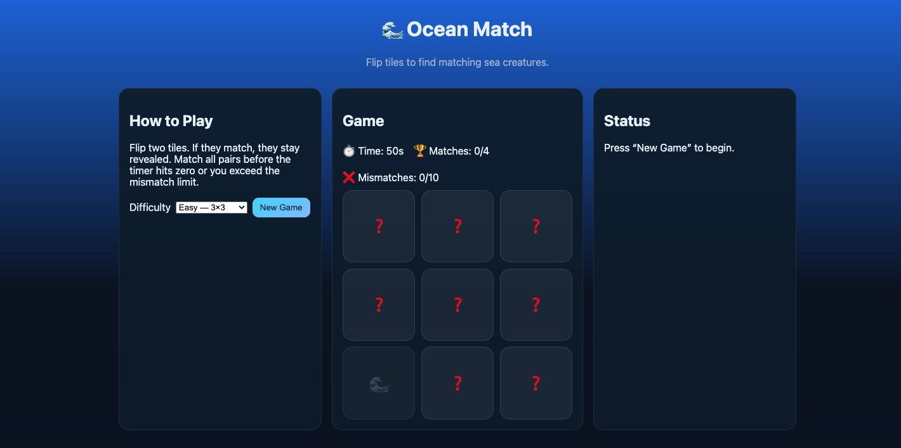

## 🖼️ Screenshot

🌊 Ocean Match

A fun ocean themed memory matching game built with HTML, CSS, and JavaScript.

🎮 How to Play
Flip two tiles to reveal ocean creatures if they match, they stay revealed.  
Match all pairs before the timer runs out or you exceed the mismatch limit.

🧩 Features
- 3 difficulty levels:
  - Easy (3×3)
  - Medium (5×4)
  - Hard (6×4)
- Timer countdown and mismatch limit
- Responsive layout using Flexbox and Grid
- Accessible buttons and status updates
- Confetti celebration 🎉 when you win
- Replayable without reloading the page

## 🛠️ Tech Stack
- HTML5  
- CSS
- JavaScript

🚀 Live Demo

👉 Play Ocean Match on GitHub Pages https://github.com/tomrhysjones/ocean-match
